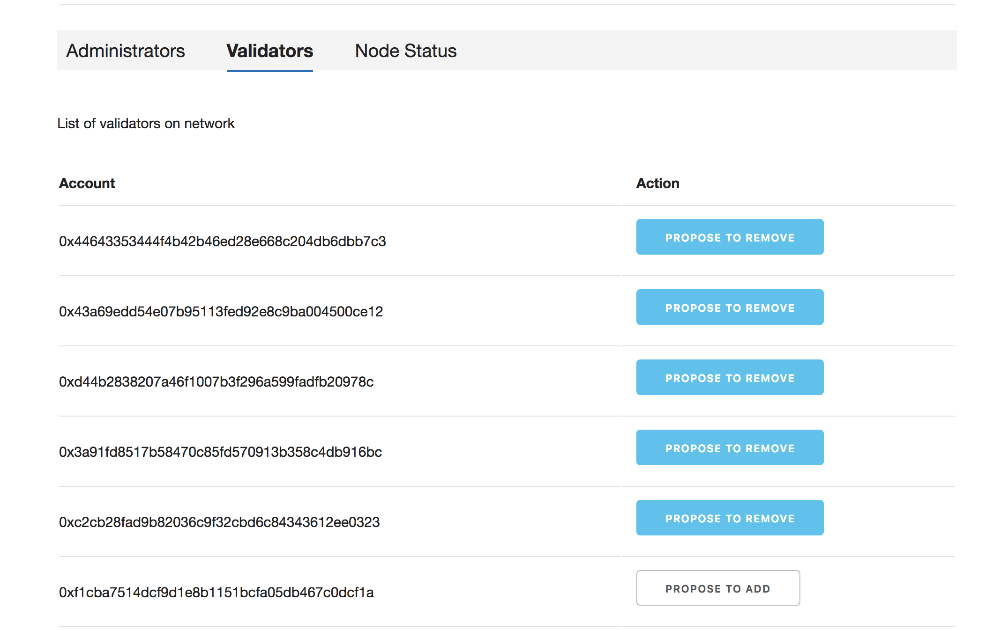

# Governance App
Goveranance App contains smart contracts to manage admin and individual validators to come on platform. 

# How the solution will be used?
  - AdminContractSet - This contract facilitates existing admins to allow new admin to get added to the team by voting with in and also, to vote out to remove it from the team
  - SimpleContractSet - This contract facilitates manage the validators life cycle on the platform, let one of the existing admin add validator or remove validator.

## Tech
It uses the private key of ethereum accounts for writing signed transactions on blockchain so need keystore files in the path

It is designed to work along with yml file which is part of the repo. The IBFT test setup will start 7 validators nodes with each having one coinbase account. One of the coinbase account i.e. @http://localhost:8545 is used to deploy adminValidator (admin solidity contract) and simpleValidator (validator solidity contract)

## Getting Started

### Clone the repo and install the project
- git clone https://github.com/ledgerium/governanceApp.git
- cd governanceApp

### Bring up the geth nodes using docker compose
NOTE: If there are existing docker instances (sudo docker ps -a), stop and remove them
 - sudo docker stop $(sudo docker ps -aq)
 - sudo docker rm $(sudo docker ps -aq)
 
1. Create docker network by running this command
- docker network create -d bridge --subnet 172.16.239.0/24 --gateway 172.16.239.1 app_net
2. Run the geth nodes by running
- docker-compose up -d

### We also use truffle for compiling smart contract so truffle can be installed and run compile
- sudo npm install -g truffle
- truffle compile

### Run the smart contracts
- npm install

#### Running with events ON - provide the ws switch
node index.js ws hostname=localhost subscribePastEvents port=9000 readkeyconfig=true usecontractconfig=true runsimplevalidator=getListOfActiveValidators,addSimpleSetContractValidatorForAdmin,0xf1cba7514dcf9d1e8b1151bcfa05db467c0dcf1a,removeSimpleSetContractValidatorForAdmin,0xf1cba7514dcf9d1e8b1151bcfa05db467c0dcf1a

#### Running without events ON - provide the http switch
node index.js http hostname=localhost port=8545 readkeyconfig=true usecontractconfig=true runsimplevalidator=getListOfActiveValidators,addSimpleSetContractValidatorForAdmin,0xf1cba7514dcf9d1e8b1151bcfa05db467c0dcf1a,removeSimpleSetContractValidatorForAdmin,0xf1cba7514dcf9d1e8b1151bcfa05db467c0dcf1a

This will bring up 
- 7 geth node docker instances
- 7 correspnding constellation node docker instances
- 1 quorum-maker front end app docker instance
- 1 eth-stat front end app docker instance


# governanceUI
The Ledgerium governance app UI

The governance UI is a NodeJS application using handlebars. To run it locally (assuming the dev environment setup is done as per https://github.com/ledgerium/LedgeriumWiki) run this after installing the dependencies. The governanceUI also expects the smart contract is up to date with latest bytecode and contract address.

Governance UI is a Dapps that works with [Metamask](https://metamask.io/) for making signed transactions. Metamask has to be installed to use the governance app.

```
node governanceUI.js
```

The GovernanceUI is served default from port `3002`. Access localhost:3002 from your browser.

All transactions have to be signed by the privatekey managed by the metamask plugin on the browser.

It is also important to note that certain actions will be restricted if the account is not an **admin**, admins or not are determined by the smartcontracts deployed initially. EOAs can be only validators without being an admin, they can participate in the voting/consensus rounds to votein/voteout other validators.



